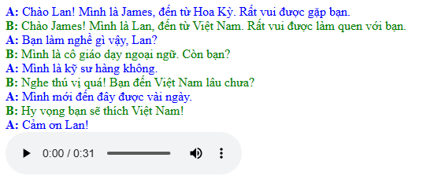

# Tóm tắt kết quả đạt được
### 1.Tạo thư mục utils nằm trong thư mục src của dự án
 - Trong thư mục này chứa file `extractor.js`, file này chứa 3 hàm xử lý việc trích xuất text thuần từ thư mục `input`.
## 01. Trích xuất text thuần 
 - Hàm `extractTextFromSsml(input, output)` với 2 tham số: input chính là file `ssml.xml` và output chính là file 
 `output.txt` dùng để trích xuất text thuần 

## 02. Hàm cải tiến
 - Hàm `extractTextWithLabels(inputFile, outputFile)` được cải tiến từ hàm trên, sau khi trích xuất sẽ được file 
 `output_AB.txt` với nội dung sẽ có thêm label `A` và `B` của 2 speaker

## 03. Hàm trích xuất Timestamp
 - Hàm `extractTimestamps(input, output)` cũng có 2 tham số. Tham số đầu vào là file `timestamp.json`, sau khi trích xuất
 sẽ được file `timestamp.txt` với nội dung như sau :
```
50,225,925,4
300,250,930,3
575,50,933,1
1462,350,935,4
1900,125,940,2
2112,225,943,5
2375,213,948,1
2612,225,950,3
2900,125,954,2
3037,188,957,3
3325,175,961,2
3525,63,963,1
4425,238,965,3
4700,213,969,3
4962,163,973,4
5175,150,978,3
5350,288,982,3
5662,25,985,1
6537,213,1028,4
6812,250,1033,5
7100,50,1038,1
7987,213,1040,4
8225,163,1045,2
8412,325,1048,3
8800,188,1051,1
9000,238,1053,3
9287,138,1057,2
9450,200,1060,4
9687,250,1065,3
9962,50,1068,1
...other
```
- Sau khi chạy câu lệnh `node src/utils/extractors.js` sẽ hiển thị ra 3 file output như yêu cầu đề bài trong thư mục `output`

## 04.Ứng dụng Vue.js
Ứng dụng có 2 component: 
- `HightlightTexted` dùng để render text từ file `output/output_AB.txt` và tạo style hightlight cho các text ứng với index của
timestamp.
- `AudioPlayer` dùng để hiển thị trình phát âm thanh. 
- `App.vue` là component cha bao gồm 2 component trên.
- Sử dụng hàm `fetch()`, 1 api sẵn có trong javascript để lấy data từ các file input.
- 
### 2.Kết quả đạt được:


